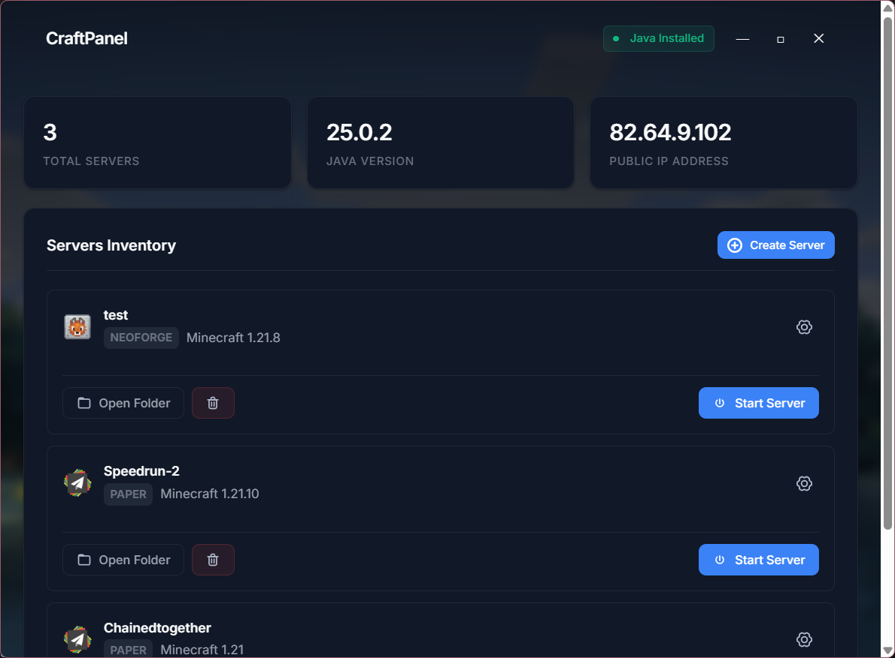

# CraftPanel

CraftPanel is free, open-source software that makes it easy to manage your Minecraft servers. With just a few clicks, you can download your server in the version and with the loader of your choice. You can also start it with various settings, such as the amount of RAM, auto-restart, or the use of flags.

> [!IMPORTANT]
> This software is not designed to be used for managing public servers that are hosted for extended periods of time.

## Supported loader

| Loader   | Supported |
| -------- | :-------: |
| Vanilla  |    ✅     |
| PaperMC  |    ✅     |
| Fabric   |    ✅     |
| Purpur   |    ✅     |
| Velocity |    ✅     |
| Folia    |    ✅     |
| Quilt    |    ✅     |
| Forge    |    ⚠️     |
| NeoForge |    ⚠️     |
| Spigot   |    ❌     |
| Bukkit   |    ❌     |

## Installation

_This software is designed has only been tested on Windows 11._

### Pre-compiled version

You can download a pre-compiled version from the [Releases](https://github.com/SkillFXX/CraftPanel/releases/) page.

### Compile the project yourself

```bash
    git clone https://github.com/SkillFXX/CraftPanel # Clone the repository
    cd CraftPanel

    npm install # Download dependencies

    npm run start # Launch the app
```

You can also build it using `electron-builder`

```bash
    npm run build
```

## Preview


